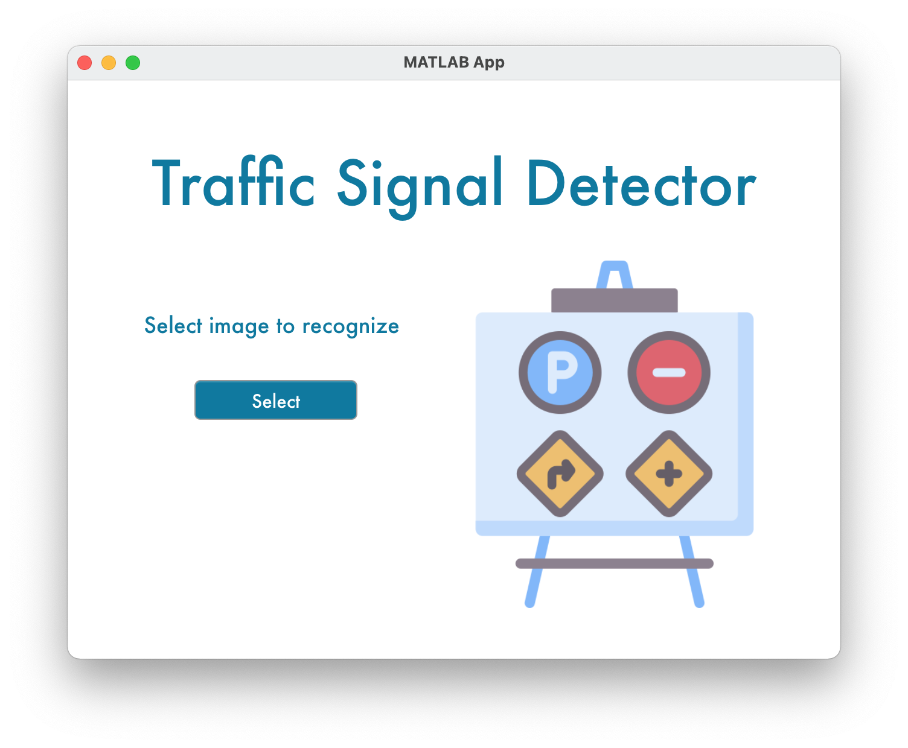
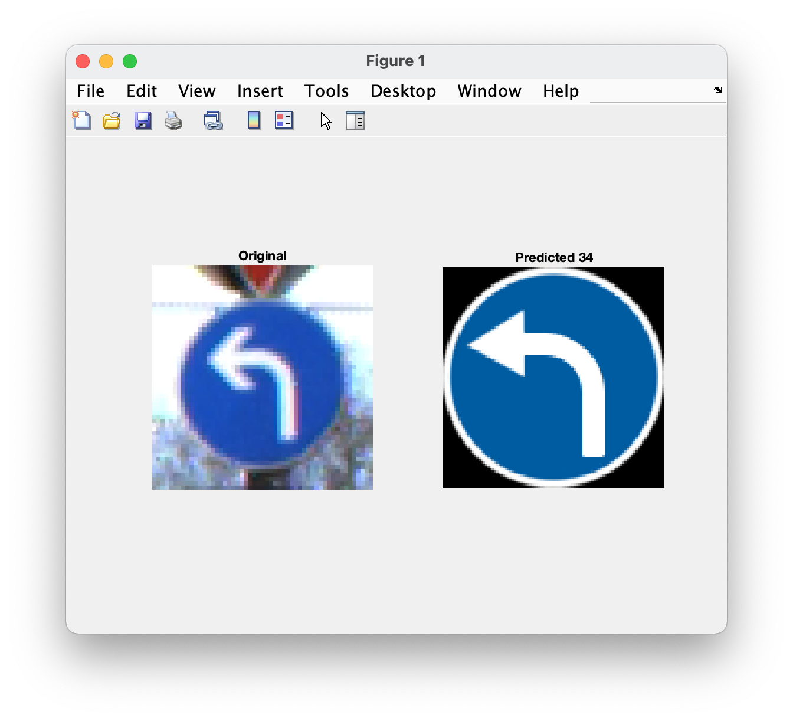
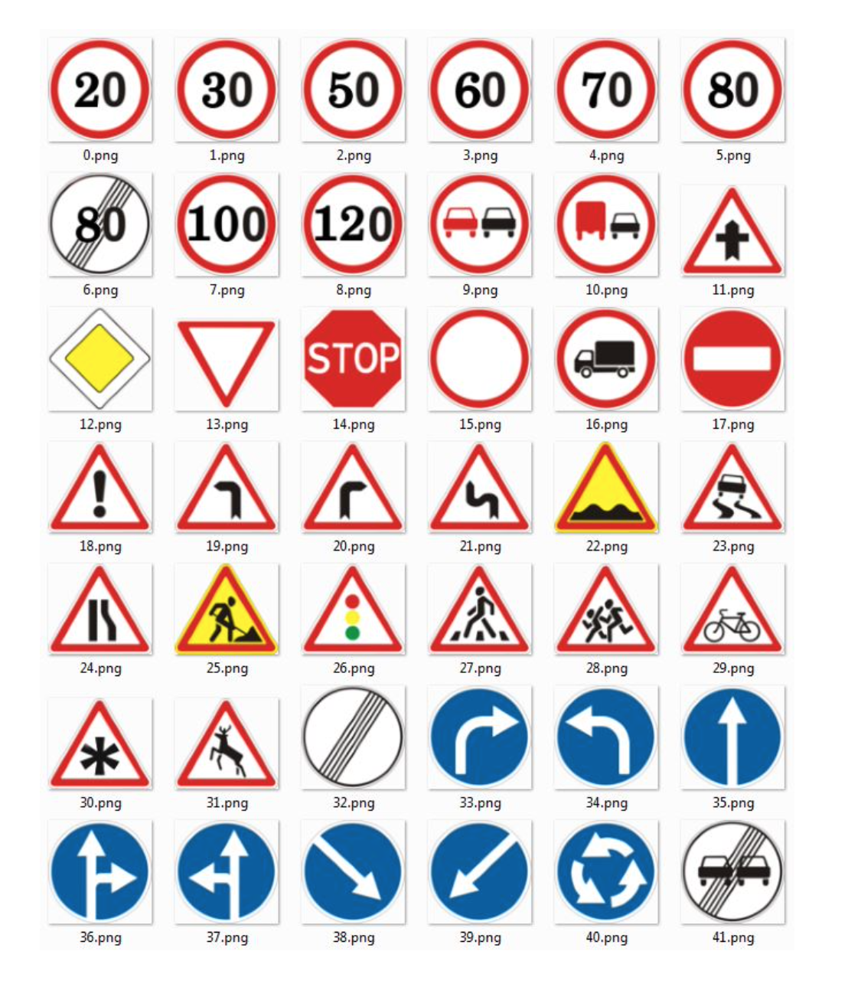

# Traffic signals recognition

The aim of the practice is to correctly identify a traffic signal from one of the 43 proposed signals:




Download the project and execute the App.m file

```matlab
>> App;
```

Then it will appear the following window.




Selecting the image that you want to predict, it will appear another window with the results.



## More Information

For more information about the project, see the following document: 

- [Report](https://github.com/MarcDV1999/Traffic-signals/tree/main/Doc/Report.pdf)

## Autor

- **Marc Domènech i Vila** - *Initial work* - [MarcDV1999](https://github.com/MarcDV1999)
- **Gerard Palomares** - *Initial work* - [ThePalo](https://github.com/ThePalo)

## License

This project is licensed under the MIT License - see the [LICENSE.md](https://github.com/MarcDV1999/4-en-Ratlla/blob/master/LICENSE.md) file for details

